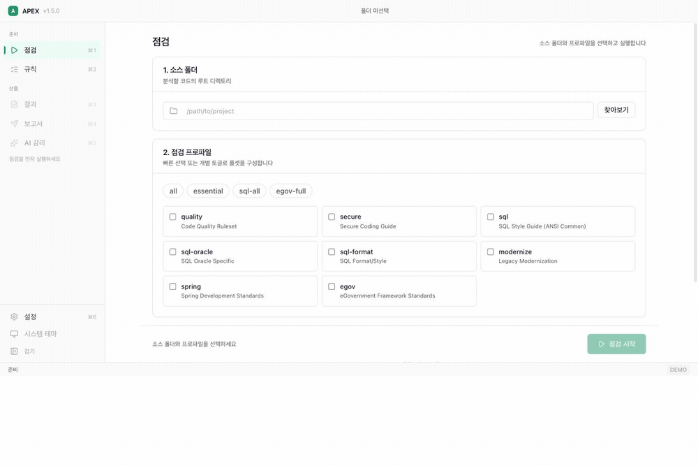
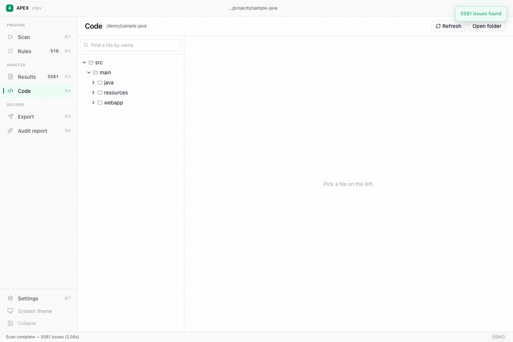
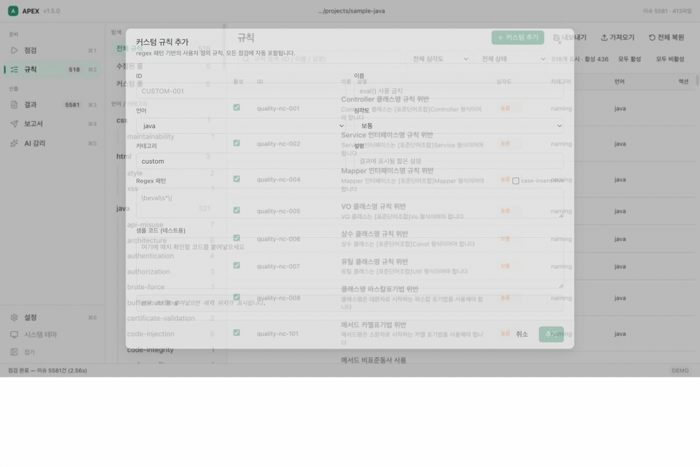
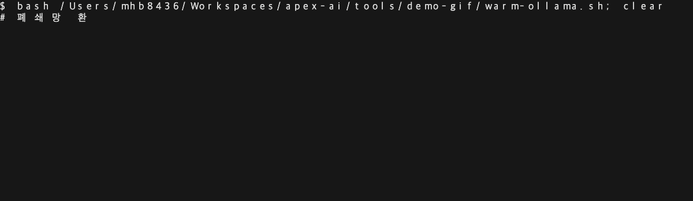

<!-- 이 파일은 apex-releases 저장소의 루트 README 로 배포된다.
     릴리스 워크플로가 통째로 복사하므로, 배포 repo에서 직접 고치면
     다음 릴리스에 지워진다. 문구 수정은 여기서 한다.
     링크가 docs/ 로 시작하는 것은 배포 repo 루트 기준이기 때문이다. -->
# APEX — 외부 반출이 금지된 코드를 위한 오프라인 정적 분석 도구

> Java, JavaScript, HTML, CSS, SQL, XML을 지원하는 **535개 규칙** 기반 정적 분석 도구.
> 단일 엔진 기반의 데스크톱 앱(GUI)과 CLI, 소스코드 편집기 내장, **완전한 로컬 완결형(Zero-Egress)**.
> 별도 설치 없이 압축 해제 후 즉시 실행 — JVM, Node.js, Python 불필요.

[](https://github.com/mhb8436/apex-releases/releases/latest)
[](https://github.com/mhb8436/apex-releases/releases)
[](#설치-안내)
[](https://www.gnu.org/licenses/agpl-3.0)

[**다운로드**](https://github.com/mhb8436/apex-releases/releases/latest) ·
[빠른 시작 가이드](docs/QUICK_START.ko.md) ·
[커스텀 규칙 작성법](docs/CUSTOM_RULES.ko.md) ·
[English](README.md)

## 왜 APEX인가

**소스코드의 외부 반출이 원천 차단된 환경에서 작동합니다.**  
국방, 공공, 금융 등 가장 엄격한 보안 심사가 요구되는 곳일수록 대다수의 최신 개발 도구는 반입조차 어렵습니다. APEX는 외부 네트워크 연결이 일체 필요 없으며, `--offline` 옵션을 통해 이를 시스템 레벨에서 강제합니다. DNS 질의를 포함하여 루프백(127.0.0.1) 이외의 모든 아웃바운드 연결을 해석된 IP 레벨에서 원천 차단합니다.  
[외부 통신을 의도적으로 실패시켜 차단 여부를 증명하는 데모](docs/AIRGAP_VERIFICATION.ko.md)를 확인해 보세요.

**별도의 코드 에디터를 반입할 필요가 없습니다.**  
앱 내에서 프로젝트 디렉터리를 탐색하고, 구문 강조(Syntax Highlighting)가 적용된 소스를 읽으며, 결함 위치로 즉시 이동해 수정하고, 해당 파일만 바로 재검사할 수 있습니다. 실행 파일 반입마다 보안 승인이 필요한 현장에서 승인 절차를 하나 줄일 수 있습니다.

**언제나 일관된 검사 결과를 보장합니다.**  
동일한 소스코드라면 언제 돌려도 항상 동일한 순서로 동일한 결함을 검출합니다. 정밀한 분석이 필요한 규칙은 단순 정규식 텍스트 매칭이 아닌 AST(추상 구문 트리) 기반으로 판정하므로 공식 감리 및 감사에서도 높은 신뢰성을 보장합니다.

**사내 인프라에서 구동하는 AI 감리 보고서.**  
사내 구축형 Ollama나 vLLM 서버 등 OpenAI 규격을 지원하는 엔드포인트라면 무엇이든 연동됩니다. 코드가 외부 클라우드 API로 전송될 염려 없이 온프레미스 환경에서 보고서를 작성할 수 있습니다.

**기존 린터가 놓치는 DB 스키마 교차 분석.**  
DDL 스키마 파일만 지정하면 MyBatis XML, 독립 `.sql` 파일, Java 소스 내 인라인 SQL까지 실제 스키마와 대조 분석합니다. 누락된 인덱스, 복합 인덱스 선두 컬럼 누락, 존재하지 않는 컬럼 참조 등을 정확하게 잡아냅니다.

<!-- APEX-DEMO:START -->
## 데모

### 점검 실행 — 데스크톱 앱



전자정부 표준프레임워크 기반의 실제 프로젝트(413개 파일, 128,497줄)를 2.56초 만에 점검하는 화면입니다. (경로와 클래스명은 마스킹 처리되었으며, 수치는 실제 측정값입니다.)

### 소스 열람 및 즉시 수정·재검사 — 데스크톱 앱



기존 정적 분석 도구 대부분은 결함 검출 보고서 제공에 그칩니다. 반면 APEX는 파일 검색 후 소스코드를 열면 발견된 결함이 에디터 여백(Gutter)과 미니맵에 시각화되어 방향키나 `F8` 단축키로 빠르게 오갈 수 있습니다.

[편집]을 눌러 코드를 수정하고 저장하면 **해당 파일만** 즉시 증분 재검사합니다. 11건의 결함이 10건으로 줄어드는 것을 확인하기 위해 프로젝트 전체를 다시 돌릴 필요가 없습니다.

에디터가 앱에 내장되어 있어, 모든 실행 파일 반입 시 승인이 필요한 현장에서 반입 승인 대상을 하나 줄일 수 있습니다.

### 커스텀 규칙 추가 — 데스크톱 앱



팀 개발 표준을 정규식으로 등록하면 다음 점검부터 바로 반영됩니다. 저장 전 샘플 코드를 붙여넣어 매칭 결과를 즉시 검증할 수 있으며, 실제 점검 엔진과 동일한 로직으로 판정하므로 사전 테스트에서 잡힌 패턴이 본 점검에서 누락되는 일은 없습니다.

### 완전 오프라인 환경의 AI 감리 보고서 생성 — 터미널



OpenAI 호환 규격을 지원하는 엔드포인트라면 사내 구축형 Ollama나 vLLM 서버로도 완벽히 작동합니다. 클라우드 API도, 외부 인터넷 연결도 쓰지 않습니다.

핵심은 `--offline` 옵션입니다. 루프백 이외의 모든 연결을 거부하며, 호스트명이 아닌 실제 해석된 IP 레벨에서 판정하므로 도메인 우회나 DNS 질의 시도 자체까지 차단됩니다.

영상에서는 **먼저** 외부 엔드포인트를 지정하여 DNS 조회 단계부터 실패하는 것을 보여줍니다. 그다음 엔드포인트만 로컬 서버로 바꾼 동일한 명령어가 정상적으로 보고서를 생성합니다. 외부 통신이 차단되어야 할 때 확실히 차단됨을 직접 확인하실 수 있습니다.

직접 실행해보기: [폐쇄망 환경 검증 가이드](docs/AIRGAP_VERIFICATION.ko.md)

<!-- APEX-DEMO:END -->

## 하나의 엔진, 두 가지 인터페이스 (GUI & CLI)

APEX는 동일한 룰 엔진 위에 데스크톱 앱(GUI)과 CLI를 함께 제공합니다. 특정 인터페이스의 기능이 제한된 축소판 형태가 아니며, 상황에 맞춰 유연하게 조합해 사용할 수 있습니다.

| 구분 | 데스크톱 앱 (`apex-gui`) | CLI (`apex`) |
|---|---|---|
| 주요 용도 | 코드 탐색 및 결함 조치, 룰셋 튜닝, 산출물 보고서 작성 | CI/CD 파이프라인, 정기 점검, 배치 스크립트 |
| 지원 플랫폼 | Windows x64, macOS (Apple Silicon / Intel) | Windows, macOS, Linux — x64, ARM64, x86 |
| 보고서 형식 | Excel, HTML, JSON, AI 감리 보고서, DOCX | 콘솔 출력, Excel, HTML, JSON, AI 감리 보고서, DOCX |
| 규칙 설정 | GUI 토글, 정규식 즉석 검증, 룰셋 YAML 직접 편집(유효성 검증 포함) | YAML 설정 파일, CLI 옵션 |

두 인터페이스는 단 하나의 파일로 연결됩니다. **데스크톱 앱에서 저장한 규칙 스냅샷이 CLI가 읽는 바로 그 YAML 파일**이므로, 개발자가 검토하고 결정한 기준이 이후 모든 자동화 실행에 그대로 적용됩니다.

```
데스크톱 앱 (규칙 탭)               ruleset.yaml              CI/CD 파이프라인 (매 빌드)
 규칙 온/오프 및 심각도 조정   ──▶   스냅샷 저장   ──▶   apex ./src --overrides ruleset.yaml
```

역할 분담은 명확합니다. 사람은 GUI에서 직관적으로 규칙을 결정하고, 파이프라인은 CLI로 이를 반복 자동화합니다. 동일한 엔진이 동일한 설정 파일을 참조하므로 환경에 따른 분석 결과의 불일치가 전혀 발생하지 않습니다.

## 설치 안내

[GitHub Releases](https://github.com/mhb8436/apex-releases/releases)에서 다운로드할 수 있습니다. 각 패키지는 자체 완결형(Self-contained) 독립 바이너리로 제공되어 별도 설치 없이 압축만 풀면 바로 실행됩니다.

| 플랫폼 | 패키지 파일명 | 포함 바이너리 |
|---|---|---|
| Windows x64 | `apex-windows-amd64.zip` | `apex.exe`, `apex-gui.exe`, `apex-report.exe` |
| macOS Apple Silicon | `apex-darwin-arm64.tar.gz` | `apex`, `apex-gui`, `apex-report` |
| macOS Intel | `apex-darwin-amd64.tar.gz` | `apex`, `apex-gui`, `apex-report` |
| Linux x64 | `apex-linux-amd64.tar.gz` | `apex` |
| Linux ARM64 | `apex-linux-arm64.tar.gz` | `apex` |
| Windows x86 | `apex-windows-386.zip` | `apex.exe` |
| Linux x86 | `apex-linux-386.tar.gz` | `apex` |

데스크톱 앱만 단독으로 필요한 경우 개별 바이너리로도 내려받을 수 있습니다:  
`apex-gui-windows-amd64.exe`, `apex-gui-darwin-arm64`, `apex-gui-darwin-amd64`

> **참고 (Linux 환경):** Linux용 데스크톱 앱은 제공되지 않습니다. Wails 프레임워크의 빌드 타임 GTK/WebKit 의존성 문제로 현재는 CLI 바이너리만 제공됩니다. Linux 환경에서는 `apex` CLI를 사용하세요.

### Windows

압축을 풀고 `apex-gui.exe`를 실행합니다. 데스크톱 앱은 Microsoft WebView2 런타임을 통해 UI를 렌더링하며, Windows 11 및 최신 Windows 10에는 기본 탑재되어 있습니다. 구버전 환경이라면 [WebView2 Runtime](https://developer.microsoft.com/microsoft-edge/webview2/)을 먼저 설치해 주세요. CLI인 `apex.exe`는 별도 런타임 없이 단독 실행됩니다.

### macOS

```bash
tar xzf apex-darwin-arm64.tar.gz
cd apex-darwin-arm64

# 코드 서명 미적용에 따른 Gatekeeper 격리 속성 해제
xattr -dr com.apple.quarantine .

./apex-gui          # 데스크톱 앱 실행
./apex --help       # CLI 도움말
```

`xattr` 명령을 건너뛰면 macOS에서 "손상된 앱" 경고가 발생할 수 있습니다. (현재 서명 및 공증 작업이 진행 중입니다.)

### Linux

```bash
tar xzf apex-linux-amd64.tar.gz
cd apex-linux-amd64
./apex ./src --profile=essential
```

## 알려진 이슈

- **macOS 전체화면 모드에서 폴더 선택 창 즉시 닫힘 현상**: 전체화면 상태에서 [찾아보기]를 누르면 파일 선택 다이얼로그가 열리자마자 닫히는 이슈가 있습니다. 원인 파악 중이며, 당분간은 **창 모드에서 폴더를 선택한 뒤 전체화면으로 전환**하거나 경로를 직접 입력란에 붙여넣어 사용해 주세요.
- **macOS 앱 미서명 경고**: 최초 실행 시 "손상되었기 때문에 열 수 없습니다" 안내가 표시될 수 있습니다. 압축 해제 디렉터리에서 `xattr -dr com.apple.quarantine .`를 실행해 주세요.
- **Linux GUI 미지원**: Linux 환경에서는 CLI 바이너리(`apex`)만 지원됩니다.

## 시작하기

### 데스크톱 앱 (GUI)

1. **점검 (`Ctrl/Cmd+1`)**: [찾아보기]로 점검할 소스 폴더를 지정하고, 적용할 프로파일과 최소 심각도를 설정합니다. 필요 시 DDL 파일이나 폴더를 지정해 교차 분석을 활성화합니다. [점검 실행]을 누르면 실시간 진행률이 표시되며 도중에 취소할 수도 있습니다.
2. **결과 (`Ctrl/Cmd+3`)**: 품질 지표 및 등급 대시보드, 그리고 상세 이슈 목록을 확인합니다. 이슈를 클릭하면 해당 소스 파일의 해당 라인으로 즉시 이동합니다.
3. **규칙 (`Ctrl/Cmd+2`)**: 프로젝트에 불필요한 규칙을 끄거나 심각도를 조정하고, 정규식 커스텀 규칙을 등록해 사전 샘플로 테스트합니다. 설정 후 **스냅샷을 YAML 파일로 저장**하면 CI 파이프라인에서 그대로 재활용할 수 있습니다.
4. **코드 (`Ctrl/Cmd+4`)**: 프로젝트 파일을 탐색하고 구문 강조가 적용된 소스를 확인합니다. [편집]을 눌러 수정 후 저장하면 **해당 파일만 즉시 증분 재검사**됩니다.
5. **보고서 (`Ctrl/Cmd+5`)**: 결과를 Excel, HTML, JSON으로 내보냅니다. 통상 납품 산출물로는 Excel을, AI 감리 보고서의 입력 데이터로는 JSON을 사용합니다.
6. **AI 감리 (`Ctrl/Cmd+6`)**: OpenAI 호환 엔드포인트를 통해 감리 보고서를 자동 생성합니다. 오프라인 폐쇄망 모드를 지원합니다. 자세한 내용은 [AI 감리 보고서](#ai-감리-보고서)를 참고하세요.

### 명령행 인터페이스 (CLI)

```bash
# 전체 규칙으로 점검 수행 (결과는 콘솔 표준 출력)
apex ./src --profile=all

# 품질 및 보안 규칙만 점검 (High 심각도 이상)
apex ./src --profile=quality,secure --min-severity=high

# Excel 보고서 생성 (납품용 산출물에 주로 활용)
apex ./src --profile=all -o excel --output-file=report.xlsx

# HTML 및 JSON 보고서 생성
apex ./src --profile=all -o html --output-file=report.html
apex ./src --profile=all -o json --output-file=report.json

# 데스크톱 앱에서 설정한 규칙 스냅샷(YAML) 적용
apex ./src --profile=all --overrides=ruleset.yaml -o excel --output-file=report.xlsx

# CLI 옵션으로 조정한 규칙 구성을 YAML 스냅샷으로 저장
apex ./src --profile=all \
  --exclude-rule quality-nc-001,sql-fmt-003 \
  --min-severity=high \
  --save-overrides=ruleset.yaml

# DDL × 쿼리 교차 분석 실행
apex ./src --profile=sql-ddl --ddl=./ddl/

# 한국어 출력 모드
apex ./src --profile=all --lang=ko
```

> GUI와 CLI 모두 기본 언어는 영어입니다. 데스크톱 앱은 **설정**에서 언어를 변경할 수 있으며, CLI는 `--lang` (`en` / `ko`) 옵션 또는 `APEX_LANG` 환경변수를 따릅니다. 실행 환경에 따라 언어 출력이 임의로 바뀌는 것을 방지하기 위해 시스템 로캘(OS Locale)은 자동으로 참조하지 않습니다.

## 프로파일 가이드

프로파일은 점검 목적에 맞게 규칙들을 묶어둔 단위입니다. 쉼표(`,`)로 여러 개를 조합해 지정할 수 있습니다.

| 프로파일 | 점검 영역 | 규칙 수 | 기본 활성 |
|---|---|---|---|
| `quality` | 코드 품질 — 명명 규칙, 표준 로깅, 복잡도, 미사용 코드 | 125 | 107 |
| `secure` | 시큐어코딩 — 인젝션, 암호화, 인증, 예외 처리 누락 | 131 | 123 |
| `sql` | ANSI SQL 공통 (DB 벤더 독립적) | 120 | 102 |
| `sql-oracle` | Oracle 특화 — NVL, 힌트, ROWNUM, DECODE 등 | 20 | 18 |
| `sql-format` | SQL 서식 및 코딩 스타일 | 7 | 7 |
| `modernize` | 레거시 현대화 — eGovFrame 3→4, javax→jakarta, iBatis→MyBatis | 50 | 39 |
| `spring` | Spring / Spring Boot 표준 규약 | 32 | 28 |
| `egov` | 전자정부 표준프레임워크 준수 여부 | 33 | 12 |
| `ddl` | DDL 스키마 × 쿼리 교차 분석 (`--ddl` 필요) | 17 | 17 |
| | **전체 합계** | **535** | **453** |

일부 규칙은 결함이라기보다 팀 컨벤션이나 취향에 가까워(SQL 서식 및 일부 전자정부 관례) 기본적으로 비활성화되어 배포됩니다. 데스크톱 앱의 규칙 탭이나 오버라이드 파일에서 손쉽게 활성화할 수 있습니다.

### 프로파일 그룹

| 그룹명 | 포함 프로파일 |
|---|---|
| `all` | quality, secure, sql, sql-oracle, sql-format, modernize, spring, egov |
| `essential` | quality, secure |
| `sql-all` | sql, sql-oracle, sql-format |
| `sql-ddl` | sql, sql-oracle, ddl |
| `egov-full` | quality, secure, sql, sql-oracle, sql-format, egov, spring |
| `migration` | modernize, spring |

`apex profiles` 명령을 실행하면 현재 바이너리에서 지원하는 전체 프로파일 및 그룹 목록을 확인할 수 있습니다.

## 주요 점검 항목

### 코드 품질 (`quality`)

- 클래스 명명 규칙 준수 — Controller, Service, ServiceImpl, Mapper, VO, Const, Util
- `System.out.println` 사용 금지 및 로거 사용 강제
- 로거 내 문자열 접합 연산(`+`) 금지 및 `{}` 바인딩 플레이스홀더 사용
- 빈 catch 블록, 미사용 코드(Dead Code), 비대한 클래스(God Class) 탐지
- 메서드 길이 및 순환 복잡도(Cyclomatic Complexity) 측정
- MyBatis XML — `SQL_ID` 주석 필수, `${}` (동적 바인딩) 사용 제한, namespace 필수

### 시큐어코딩 (`secure`)

- SQL 인젝션 — `createStatement()` 사용 금지, `PreparedStatement` 강제
- XSS — 취약한 DOM 조작(`innerHTML`, `document.write`) 탐지
- 명령어 삽입(Command Injection) — 외부 입력이 전달되는 `Runtime.exec()`, `ProcessBuilder` 탐지
- 경로 조작(Path Traversal), SSRF, CSRF 토큰 검증 누락 점검
- 취약한 암호 알고리즘 차단 — DES, MD5, SHA-1, RC4 금지 / RSA 2048bit+, AES 128bit+ 권장
- 하드코딩된 패스워드, 암호화 키, DB 접속 자격 증명 탐지
- `printStackTrace()` 및 응답 내 에러 메시지(`e.getMessage()`) 직접 노출 차단

### SQL (`sql`, `sql-oracle`, `sql-format`)

- `SELECT *` 금지, `LIKE` 선행 와일드카드(`%keyword`) 사용 제한
- 바인드 변수 사용 필수화, `WHERE` 절 없는 `UPDATE`/`DELETE` 구문 차단
- 안티패턴 및 코드 스멜 — `NATURAL JOIN`, `ON 1=1`, `AND`/`OR` 혼용 시 괄호 누락
- Oracle 특화 — 힌트 구문, `NVL`/`TO_CHAR` 등 인덱스 컬럼 가공 방지, `DECODE`, `ROWNUM` 페이징

### DDL × 쿼리 교차 분석 (`ddl`)

`--ddl` 옵션으로 DDL 파일이나 디렉터리를 지정하면 실제 DB 스키마와 애플리케이션의 모든 SQL 구문을 교차 검증합니다. 대상은 MyBatis XML, 독립 `.sql` 파일은 물론 Java 소스 내 인라인 쿼리(`@Select`/`@Insert`/`@Update`/`@Delete`, JPA 네이티브 쿼리, `JdbcTemplate`, 순수 JDBC, 문자열 리터럴)까지 모두 포함됩니다.

- **쿼리 정합성** — 존재하지 않는 테이블·컬럼 참조, 암시적 형변환을 유발하는 JOIN 컬럼 타입 불일치, NOT NULL 컬럼이 누락된 `INSERT`, PK 컬럼을 변경하는 `UPDATE SET`
- **인덱스 활용도** — WHERE/JOIN/GROUP BY/ORDER BY 조건에 인덱스가 없는 컬럼 사용, 복합 인덱스 선두 컬럼 누락, 인덱스 컬럼을 감싼 함수 사용
- **DDL 개선 제안** — 빈번히 조회되나 인덱스가 없는 컬럼, 외래키(FK) 인덱스 누락, 미사용·중복 인덱스, 기본키(PK)가 없는 테이블 검출

```bash
apex ./src --profile=ddl --ddl=./ddl/schema.sql
apex ./src --profile=sql-ddl --ddl=./ddl/
```

데스크톱 앱에서는 점검 탭의 **DDL 크로스 분석** 항목에서 설정할 수 있습니다.

## AI 감리 보고서

점검 결과를 바탕으로 완성된 감리 보고서 문서를 자동 생성합니다. OpenAI 규격을 준수하는 엔드포인트라면 모두 호환되므로, 사내 Ollama나 vLLM 서버를 활용하면 외부 클라우드 의존 없이 완전한 독립 환경에서 작동합니다.

- **데스크톱 앱**: 점검 실행 후 **AI 감리** 탭에서 엔드포인트와 모델명을 입력합니다. [연결 테스트]로 통신 상태를 확인한 후 생성을 진행합니다. 폐쇄망 모드는 체크박스로 간편하게 켭니다.
- **CLI**: 점검 JSON을 먼저 생성한 후 2단계 파이프라인으로 실행합니다.

```bash
# 1단계: 점검 결과 JSON 출력
apex ./src --profile=all -o json --output-file=scan.json

# 2단계: 오프라인 모드로 AI 감리 보고서 생성
apex ai-report scan.json --offline \
  --endpoint http://127.0.0.1:11434/v1 \
  --model qwen2.5-coder:7b \
  --project "OO시스템 구축사업" \
  -o report.html
```

`--offline` 옵션은 프로세스 시작 시점에 네트워크 격리 가드를 먼저 활성화합니다. 루프백 이외의 모든 통신 시도는 해석된 IP 레벨에서 거부되며 DNS 질의 자체가 차단되므로 호스트명을 통한 우회가 불가능합니다. 외부 엔드포인트가 지정되면 차단 사유를 명시하며 즉시 작업을 중단합니다.

네트워크 차단 메커니즘을 직접 검증하려면 [폐쇄망 환경 검증 가이드](docs/AIRGAP_VERIFICATION.ko.md)를 확인해 보세요. 외부 엔드포인트 차단을 먼저 확인한 후 로컬 서버로 보고서를 생성하는 전체 절차를 다룹니다.

| 옵션 | 설명 | 기본값 |
|---|---|---|
| `-o`, `--output` | 생성할 보고서 파일 경로 | `ai-report.html` |
| `--provider` | LLM 프로바이더 (`openai`(호환), `claude`, `gemini`) | `openai` |
| `--endpoint` | OpenAI 호환 엔드포인트 URL | — |
| `--model` | 모델명 | — |
| `--api-key` | API 키 (로컬 서버 사용 시 임의의 값 입력 가능) | — |
| `--project` | 보고서에 기재할 대상 프로젝트명 | 스캔 파일명 |
| `--lang` | 보고서 작성 언어 (`ko` / `en`) | 인터페이스 언어 |
| `--offline` | 폐쇄망(오프라인) 모드 (루프백 외 외부 통신 전면 차단) | `false` |
| `--timeout` | 단일 요청 타임아웃 | `5m` |

## CLI 레퍼런스

```
apex [경로] [옵션]
apex profiles                       프로파일 및 그룹 목록 조회
apex report [이름:result.xlsx ...]  Excel 결과를 바탕으로 DOCX 감리 보고서 생성
apex ai-report [scan.json]          점검 JSON 결과를 바탕으로 AI 감리 보고서 생성
```

| 옵션 | 축약 | 설명 | 기본값 |
|---|---|---|---|
| `--profile` | `-p` | 실행할 프로파일 (쉼표로 구분) | `all` |
| `--profiles-file` | | 프로파일 정의 파일 경로 | `configs/profiles.yaml` |
| `--config` | `-c` | 설정 파일 경로 | — |
| `--overrides` | | 저장해 둔 규칙 스냅샷(YAML) 적용 | — |
| `--save-overrides` | | 현재 적용된 유효 규칙 묶음을 YAML 파일로 저장 | — |
| `--output` | `-o` | 출력 형식 (`console`, `json`, `html`, `excel`) | `console` |
| `--output-file` | | 출력 파일 경로 | stdout |
| `--min-severity` | `-s` | 최소 심각도 필터링 (`low`, `medium`, `high`, `critical`) | `low` |
| `--rules` | | 점검할 규칙 카테고리 지정 | — |
| `--exclude-rule` | | 제외할 규칙 ID 지정 (쉼표로 구분) | — |
| `--ddl` | | DDL 파일 또는 디렉터리 경로 (지정 시 교차 분석 실행) | — |
| `--cross-file-only` | | 크로스 파일 분석 규칙만 실행 | `false` |
| `--summary` | | 규칙별 집계 요약 테이블 출력 (CI 로그에 적합) | `false` |
| `--no-dedup` | | 중복 검출 건에 대한 병합(Deduplication) 비활성화 | `false` |
| `--lang` | | 출력 언어 설정 (`en` / `ko`, 또는 `APEX_LANG` 환경변수) | `en` |
| `--verbose` | `-v` | 상세 로그 출력 | `false` |

## 데스크톱 앱 상세 안내

| 탭 메뉴 | 단축키 | 주요 기능 |
|---|---|---|
| 점검 | `Ctrl/Cmd+1` | 대상 폴더, 프로파일, 최소 심각도, DDL 교차 분석 설정 / 점검 실행, 취소, 진행률 확인 |
| 규칙 | `Ctrl/Cmd+2` | 규칙 활성화/비활성화, 심각도 조정, 정규식 커스텀 규칙 등록 및 즉석 테스트, 스냅샷 저장·불러오기, **룰셋 YAML 파일 인플레이스 편집** |
| 결과 | `Ctrl/Cmd+3` | 지표 및 등급 대시보드, 이슈 목록 조회, 소스코드 해당 라인 즉시 이동 |
| 코드 | `Ctrl/Cmd+4` | **프로젝트 탐색, 구문 강조 소스 열람 및 편집, 수정한 파일 즉시 증분 재검사** |
| 보고서 | `Ctrl/Cmd+5` | Excel / HTML / JSON 내보내기, 최근 내보내기 내역 관리 |
| AI 감리 | `Ctrl/Cmd+6` | 엔드포인트 및 모델 설정, 연결 테스트, 폐쇄망 모드 실행, 진행률 확인 및 취소 |
| 설정 | `Ctrl/Cmd+7` | UI 언어, 테마, AI 엔드포인트 기본값 설정 |

### 코드 조회 및 실시간 편집

APEX 자체에 내장 에디터가 탑재되어 있어 현장에 별도의 편집기를 반입할 필요가 없습니다. 이슈 목록에서 [코드에서 열기]를 클릭하면 해당 파일의 결함 라인으로 바로 이동하며, 파일 내 모든 이슈가 에디터 여백(Gutter)에 표시됩니다. [편집]을 눌러 코드를 고친 뒤 `Ctrl/Cmd+S`로 저장하면 **해당 파일만 즉시 재검사**가 수행되므로, 조치 결과를 확인하기 위해 대규모 프로젝트를 다시 스캔할 필요가 없습니다.

파일 저장 시 원본 파일의 개행 코드(CRLF/LF), 마지막 빈 줄, 파일 권한(Permission)을 그대로 보존합니다. 편집 도중 외부에서 파일이 변경된 경우 덮어쓰기를 방지하고 변경 알림을 띄웁니다. (단, 단일 파일 재검사 시에는 프로젝트 전체 문맥 파악이 필요한 크로스 파일 규칙은 제외되며, 화면에 해당 내용이 명시됩니다.)

### 규칙 변경에 따른 결과 만료 알림 (Stale Result 감지)

규칙을 비활성화하거나 심각도를 조정하고 소스코드를 수정하면, 화면에 표시된 기존 결과는 최신 상태와 일치하지 않는 만료 상태(Stale)가 됩니다. 이때 결과, 보고서, AI 감리 화면 상단에 결과 만료 알림 배너와 함께 [재점검] 버튼이 표시됩니다.

규칙을 바꿀 때마다 자동으로 전체 재점검을 돌리지 않는 이유는, 대형 프로젝트에서 토글 하나를 누를 때마다 수 초씩 지연이 발생하면 규칙 튜닝이 불가능하기 때문입니다. 사용자가 튜닝을 마친 후 원하는 시점에 재점검할 수 있도록 하되, 만료된 데이터로 잘못된 보고서를 생성하지 않도록 명확한 경고를 제공합니다.

### 직관적인 화면 내비게이션 및 이전 화면 복귀

특정 작업 흐름을 통해 진입한 화면에는 **이전 화면 복귀 링크**가 상단에 제공됩니다. 예를 들어 이슈 목록에서 소스 코드 보기로 진입하면 화면 상단에 `← 결과로 돌아가기 · secure-plain-001` 링크가 생성되며, 클릭 시 기존에 적용해 두었던 검색 필터 상태 그대로 이슈 목록에 복귀합니다.

사이드바 메뉴를 클릭해 직접 진입한 경우에는 독립적인 화면 이동이므로 복귀 링크가 표시되지 않습니다. 전역 방문 히스토리는 브라우저와 동일하게 `Ctrl/Cmd+[`(뒤로) 및 `Ctrl/Cmd+]`(앞으로) 단축키로 이동할 수 있습니다.

대시보드에서 특정 심각도나 카테고리를 클릭해 이슈 목록으로 이동한 경우, 적용된 필터 조건이 상단에 태그(Chip) 형태로 표시되며 `✕` 버튼으로 간편하게 해제할 수 있습니다.

### 앱 내 룰셋 직접 편집 및 커스텀 규칙 관리

규칙 탭의 기본 폼 UI에서는 단일 라인 정규식 규칙 생성을 지원합니다. 멀티라인 정규식(`regex-multiline`), AST 기반 규칙(`ast-*`), 정교한 제외(Exclude) 패턴 등 고급 설정은 **[룰셋 파일 편집]** 기능을 통해 YAML 파일을 직접 수정할 수 있습니다.

규칙 목록에서 내장 규칙의 `</>` 아이콘을 클릭하면 해당 규칙이 선언된 룰셋 파일이 열리며 해당 정의 라인으로 바로 포커스됩니다.

커스텀 규칙 생성 폼에서는 **패턴 매칭 범위**를 선택할 수 있습니다. [한 줄(Single-line)] 모드는 라인 단위로 개별 탐지하며, [여러 줄(Multi-line)] 모드는 파일 전체를 하나의 텍스트로 검사합니다. (예: 어노테이션과 메서드 선언부가 분리된 패턴 등은 '여러 줄' 모드로 탐지해야 합니다.) 주석 처리 라인 건너뛰기 등 제외 패턴과 검출 시 표시할 조치 가이드(Remediation)도 폼에서 설정할 수 있습니다.

내장 정규식 테스터는 실제 분석 엔진과 동일한 정규식 컴파일러 및 판정 로직을 사용하므로, 테스트 결과와 실제 분석 결과 간의 오차가 발생하지 않습니다.

룰셋 에디터는 저장 시점에 자동으로 유효성 검증(Validation)을 수행합니다. CLI 및 룰 엔진과 동일한 파서를 사용하여 중복 규칙 ID, 잘못된 심각도 값, 문법 오류가 있는 정규식 패턴을 라인 번호와 함께 표시하며, 검증을 통과하지 못한 파일은 저장되지 않습니다. 파일 덮어쓰기 시 기존 내용은 `.bak` 백업 파일로 자동 보존됩니다.

[커스텀 규칙 내보내기]를 실행하면 앱에서 생성한 규칙이 `configs/rulesets/custom.yaml` 파일로 저장되며 `custom` 프로파일로 등록됩니다. 이후 `apex ./src --profile=custom` 명령을 통해 CI/CD 파이프라인에서도 동일한 규칙을 자동 적용할 수 있습니다.

## GitHub Actions 연동

```yaml
- uses: mhb8436/apex-ai@v1
  with:
    path: './src'
    profile: 'essential'
    min-severity: 'medium'
    lang: 'ko'
```

데스크톱 앱에서 확정한 규칙 스냅샷(YAML)을 파이프라인에 지정하면, 팀 내에서 합의된 점검 기준을 그대로 빌드 파이프라인에 적용할 수 있습니다.

```yaml
- run: apex ./src --profile=all --overrides=ruleset.yaml --summary --min-severity=high
```

## 관련 문서

- [빠른 시작 가이드](docs/QUICK_START.ko.md) — 데스크톱 앱 및 CLI 설치부터 첫 보고서 생성까지
- [사용자 매뉴얼](docs/USER_MANUAL.ko.md) — 화면별, 옵션별, 규칙 카테고리별 상세 가이드
- [커스텀 규칙 작성 가이드](docs/CUSTOM_RULES.ko.md) — 맞춤형 규칙 정의 및 정규식 활용법
- [폐쇄망 환경 검증 가이드](docs/AIRGAP_VERIFICATION.ko.md) — 오프라인 네트워크 차단 메커니즘 검증

## 라이선스

APEX는 듀얼 라이선스 정책으로 배포됩니다.

- **GNU AGPLv3**: 오픈소스 프로젝트 및 비영리 목적
- **상용 라이선스 (Commercial License)**: 독점 소프트웨어 개발 및 상용 환경 구축 목적

APEX는 크래프틱시스템즈 주식회사에서 개발합니다. 상용 라이선스 도입 및 기술 지원 관련 문의는 본 저장소의 Issue로 등록해 주시기 바랍니다.
